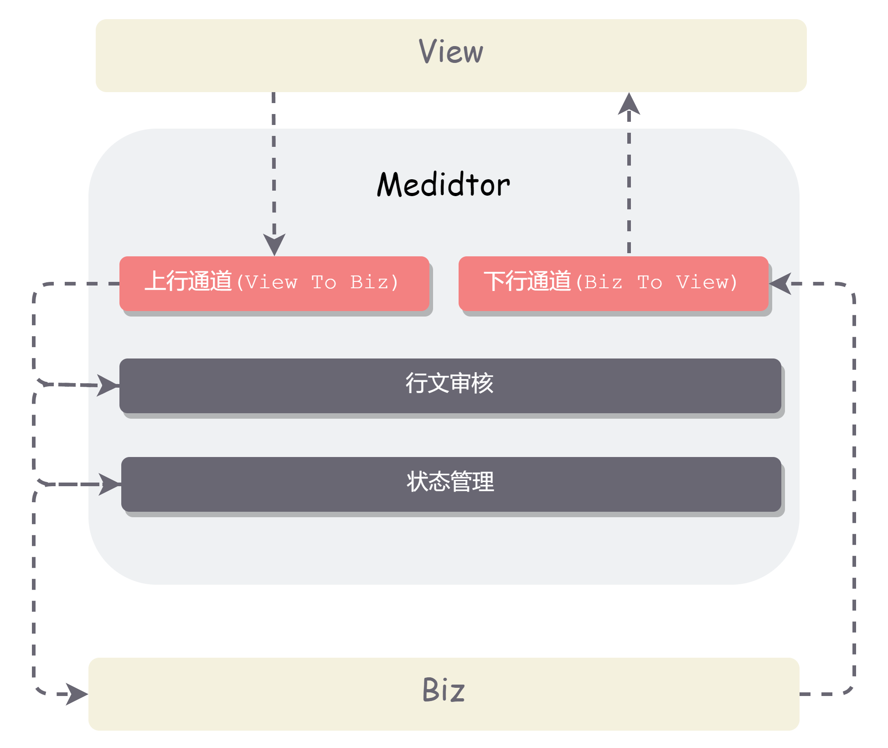

# 所谓架构设计

#架构设计

记得些许年前有个兄弟在分享会上打开自己的PPT. 第一页标题: "前端架构设计". 第二页里是个黑人, 头顶几个大字: "年度最佳笑话" 自黑的图片加旁白引得大伙笑成一片. 依稀记得那还是个流行**前端工程化** 这个关键词的年代. 他大约讲了项目更加合理的组成形式, *gulp + webpack* 工具链的使用等.

什么是架构设计? 今天我将这个问题抛给了GPT:
>架构设计是指在开发软件、构建系统或设计应用程序时，根据特定需求和目标，制定系统的整体结构和组织方式的过程。它涉及到确定系统的各个组件、模块之间的关系和交互方式，以及选择合适的技术和工具来实现系统的功能和性能要求。

前几年我试图用个抽象, 有点哲学(装B)的方式来解释:
- 定义什么是什么
- 定义什么不是什么(边界)
- 定义他们是如何联系的

几个前端坐在会议室里, 对着屏幕一顿指点, 这是数据层, BFF层, 业务层, 防腐层. 可谓神采奕奕, 意气风发. 而和业务的同学们一起评审时, 往往面临着产品听不懂, 服务半懂不懂也不关注的局面. 特别是服务的同学拍出自己的架构图时, 感觉自己说话的声音都小了几分, 毕竟人家的图大嘛(^O^笑~). 开发结束复盘时高情商的表示"我们要一起加深对业务的理解". 低情商的说"前端不懂业务".

咱们笑归笑, 但也许真的可以从业务逻辑出发, 结合服务设计和产品设计来做架构设计? 比如最近又去负责 **身份认证与权限** 这个平台. 认证部分是个年久失修的烂摊子, 各大业务部门提了新需求要后决定要重构.

当我们面对一个软件, 一个应用时, 首先应该抛弃技术相关性. 不管是前端还是后端. 不管使用的是什么 `Vue` `React` 框架. 需要科学地去定义问题, 分析问题. 采用逻辑上的方法比如: 抽象, 集成, 复用, 组合等方法, 去构建出要解决这个问题可以分解为哪些个关键的模块或是组件. 这其实就要求了对业务逻辑, 流程有较全面的了解. 当有了这些关键模块之后就应该考虑应该有什么样的底层服务来对它们做支撑. 比如这次认证模块

有了这样的业务架构做指导, 进而演进到十分核心的应用架构设计. 这时多半已经有模块, 组件的抽象.  那么接下来则是思考这些模块之间交互的接口是什么, 它们是如何被集成到一起的.  听说还有个专业名词叫做 **集成架构设计** , 不明觉厉.

到这里我们有了业务架构和应用架构, 应用之间的关系也基本明了.  那么还不明了的就剩下应用中关键模块本身. 从设计上来说它还是个黑盒. 这一步都是些耳熟能详的东西. 比如可能会设计它包含哪些
- Model
- Service
- Strategy
 
如果熟悉 DDD 的朋友可能会设计
- 聚合根
- 实体
- 值对象

通常拆解到这一步之后, 软件核心架构的内容就结束了. 我们有了核心模块的定义, 它们的边界是什么以及它们是如何交互并组织在一起的. 并且从设计上来说是高内聚低耦合的. 而所有的设计也不和实际的某个技术栈挂钩.

一时兴起写了些关于架构设计的感想和总结出来的思路. 回首之余, 顿感前路茫茫, 且行且珍惜罢.